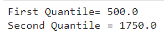
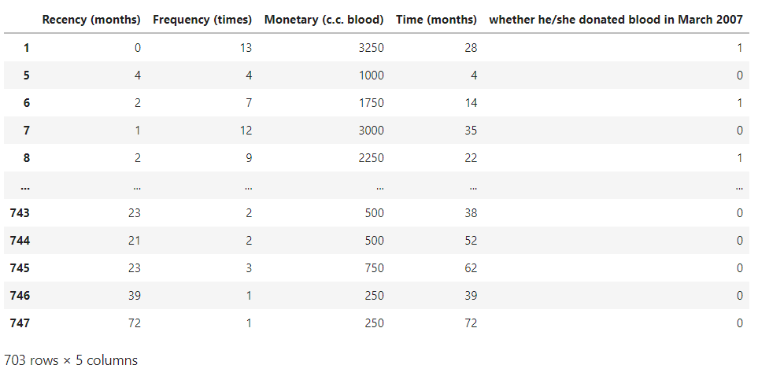

# Mini-Project:
# EXPLORATORY BLOOD TRANSFUSION ANALYSIS 

The dataset from the centralized blood center.

        *To demonstrate the RFMTC marketing model (a modified version of RFM), this study adopted the donor database of Blood Transfusion Service Center 

        *Each one included 
        R -(Recency - months since last donation), 
        F (Frequency - total number of donation), 
        M (Monetary - total blood donated in c.c.), 
        T (Time - months since first donation), and a binary variable representing whether he/she donated blood in  
        
        1 - stand for donating blood.
        
        0 - stands for not donating blood.
 
       *We use all box plot and bar plot for further analysis.

## Code:
```
import pandas as pd
import numpy as np
import seaborn as sns
df=pd.read_csv("transfusion.csv")
df
df.head()
df.info()
df.isnull().sum()
df.shape
df.describe
sns.boxplot(x="Monetary(c.c.blood)",data=df)
q1=df['Monetary(c.c.blood)'].quantile(0.25)
q3=df['Monetary(c.c.blood)'].quantile(0.75)
print("First Quantile=",q1,"\nSecond Quantile=",q3)
IQR=q3-q1
ul=q3+1.5*IQR
ll=q1-1.5*IQR
df=df[((df['Monetary(c.c.blood)']>=ll)&(df['Monetary(c.c.blood)']<=u))]
df
df.shape
sns.boxplot(x="Monetary(c.c.blood)",data=df)
from scipy import stats
z=np.abs(stats.ascore(df['Monetary(c.c.blood']))
df=df[(z<3)]
df
print(df.shape)
sns.boxplot(x="Monetary(c.c.blood)",data=df)
```
## Output:
## df:

## Head:

## Info:

## Isnull:

## Shape:

## Describe:

## Boxplot:

## Quantile:

## IQR:

## Shape:

## ZScore:

